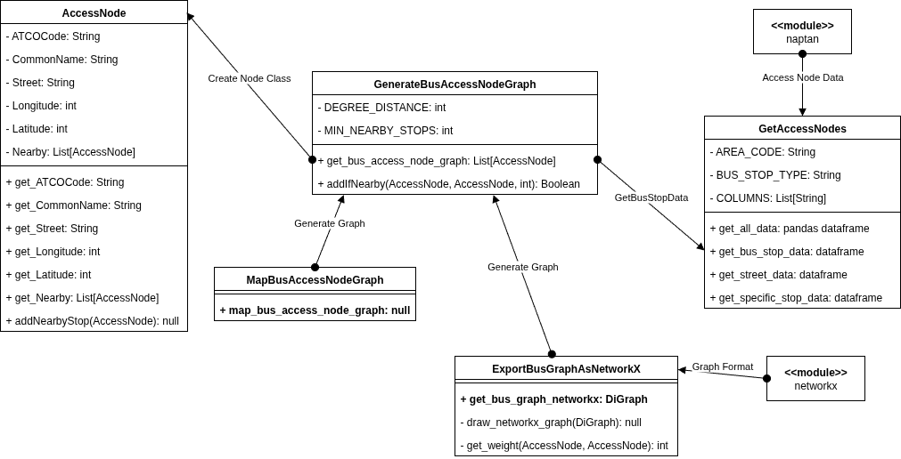

# How to use Data folder

## Required Python modules

* naptan
* matplotlib
* math
* networkx

## Exporting Bus Graph as Networkx

The function `get_bus_graph_networkx()` inside of `ExportBusGraphAsNetworkX.py`
can be used to get the bus access graph. No parameters need to be passed to
the function for it to return the graph.

## Visualising the Bus Graph

The function `map_bus_access_node_graph()` inside of
`MapBusAccessNodeGraph.py` can be used to visualise the bus access graph. No
parameters need to be passed to the function for it to visualise the
graph. The visualisation uses matplotlib, so it is slow.

## Test Data

Currently, the graph is generating using selected test data, defined in the
function `get_test_data()` inside of `GetTestData.py`. Edit this file to
adjust the data generated from the graph.

## Graph Vertices

Graph vertices have the following structure:
* ATCOCode: String
* CommonName: String
* Longitude: int
* Latitude: int
* Nearby: List[AccessNode]

Where AccessNodes reference other Graph vertex objects.

## Graph Edges

Currently, the graph edges are weighted based of distance. Each vertex has
a minimum number of edges (`MIN_NEARBY_STOPS`), defined in `GenerateBusAccessNodeGraph`,
and all within a minimum distance of `DEGREE_DISTANCE` in the same file.

## Python Files, Method and Class Graph

## Current Limitations

* Graph is not always connected
* Weight is distance, not time